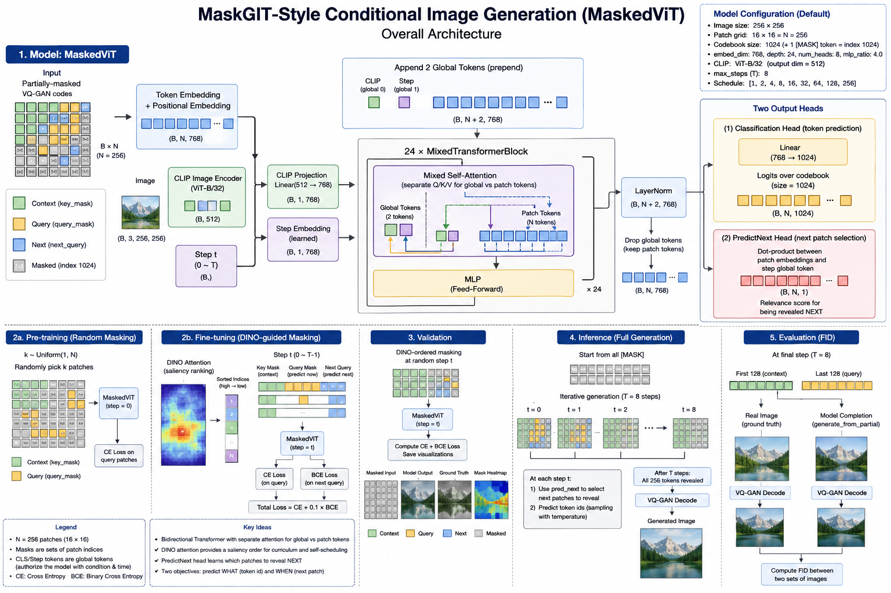
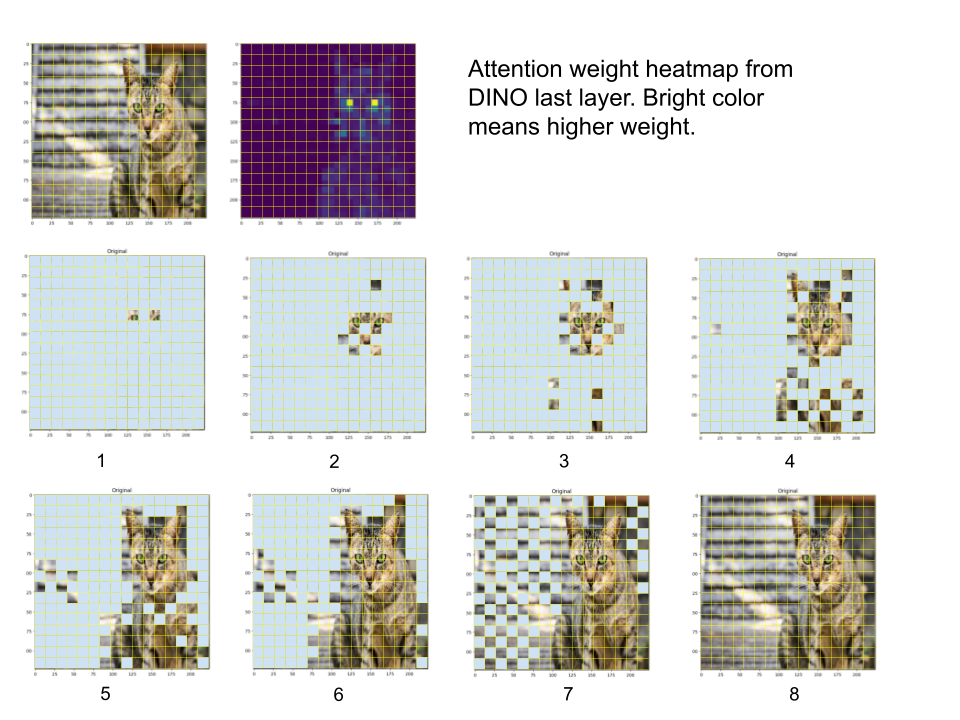
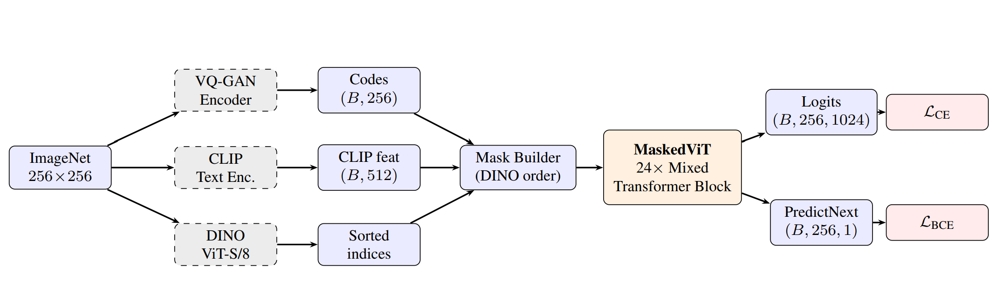

# MaskedViT: DINO-Guided Conditional Image Generation

A MaskGIT-style conditional image generation model that uses DINO attention maps to guide the token unmasking order during both training and inference.



## Overview

Standard MaskGIT unmasks tokens in a fixed or random order. This project replaces that with a **DINO-guided order**: patches are sorted by their saliency in DINO ViT-S/8 attention maps, so the model learns to reveal semantically important regions first and fill in background later.



At each training step, a random unmasking step `t` is sampled per image. The model sees the first `schedule[t-1]` tokens (in DINO order) as context and must predict the next `schedule[t] - schedule[t-1]` tokens. A secondary head (`PredictNext`) also learns to score which masked patches should be revealed next, supervised with a BCE loss.

## Model Architecture



Each 256×256 ImageNet image passes through three frozen encoders in parallel:

| Encoder | Output | Role |
|---|---|---|
| VQ-GAN | `(B, 256)` discrete codes | Tokenizes the image |
| CLIP ViT-B/32 text encoder | `(B, 512)` embedding | Class conditioning |
| DINO ViT-S/8 | `(B, 256)` sorted indices | Unmasking order |

The **MaskedViT** backbone is a 24-layer Mixed Transformer that takes the masked token sequence and CLIP conditioning and produces two outputs:
- **Logits** `(B, 256, 1024)` — predicts the VQ-GAN code at each query position (cross-entropy loss)
- **PredictNext** `(B, 256, 1)` — scores which masked patch to reveal next (binary cross-entropy loss)

At inference, the model starts with all 256 tokens masked and iteratively reveals them over 8 steps, using `PredictNext` scores to choose positions and logit sampling to fill them.

## Key Design Choices

- **DINO-sorted masking** replaces uniform random ordering with a semantically meaningful curriculum — salient foreground patches are predicted first.
- **Dual-head training** jointly optimizes token prediction (CE) and next-patch selection (BCE), tying together generation quality and ordering.
- **Per-step conditioning** injects the current unmasking step `t` as a positional embedding so the model knows how far along generation is.
- **BF16 autocast** on A100/H100 for efficient training with no accuracy loss.

## Training

```
python main.py
```

Key hyperparameters (see [configuration.py](configuration.py)):

| Parameter | Default |
|---|---|
| Image size | 256 × 256 |
| Tokens (N) | 256 (16 × 16 grid) |
| Unmasking steps (T) | 8 |
| Transformer depth | 24 layers |
| Embed dim | 768 |
| Codebook size | 1024 |
| Learning rate | 5e-5 with cosine decay |
| Warmup epochs | 4 |
| Batch size | 256 |

## Inference

```
python inference_run.py
```

Generates images conditioned on ImageNet class labels using iterative unmasking over `T=8` steps at temperature `0.7`.

## Project Structure

```
src/
├── maskgit_model.py       # MaskedViT transformer
├── trainer.py             # Training loop
├── validate.py            # Validation + visualization
├── inference.py           # Generation (full and partial)
├── dino_util.py           # DINO attention → patch sort order
├── vq_gan.py              # VQ-GAN tokenizer wrapper
├── utils.py               # Masks, schedules, visualization
├── configuration.py       # All hyperparameters
└── data.py                # ImageNet dataloader
```

## References

- [MaskGIT: Masked Generative Image Transformer](https://arxiv.org/abs/2202.04200) (Chang et al., 2022)
- [DINO: Self-Supervised Vision Transformers](https://arxiv.org/abs/2104.14294) (Caron et al., 2021)
- [Taming Transformers (VQ-GAN)](https://arxiv.org/abs/2012.09841) (Esser et al., 2021)
- [CLIP](https://arxiv.org/abs/2103.00020) (Radford et al., 2021)
